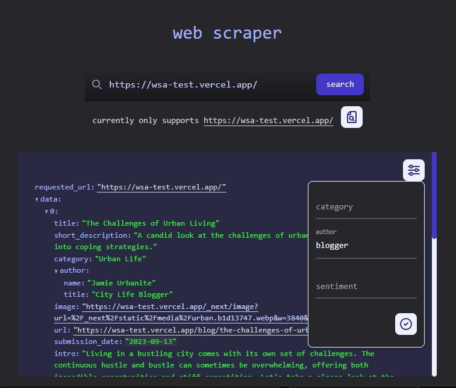

<!-- README Template thanks to: https://github.com/othneildrew/Best-README-Template -->

<a name="readme-top"></a>

<!-- TABLE OF CONTENTS -->

## basic_web_scraper

<div>
    <details>
      <summary>Table of Contents</summary>
      <ul>
        <li><a href="#about-the-project">About The Project</a></li>
        <li><a href="#getting-started">Getting Started</a></li>
        <li><a href="#usage">Usage</a></li>
        <li><a href="#proposed-features">Proposed Features</a></li>
        <li><a href="#license">License</a></li>
        <li><a href="#acknowledgments">Acknowledgments</a></li>
      </ul>
    </details>
</div>

<!-- ABOUT THE PROJECT -->

## About The Project

-   My submission for a technical test
-   Test requirements:
    -   build a web scraper in NodeJS, with ES6+ code, targetting the website https://wsa-test.vercel.app/
    -   avoid scraping based on class names or IDs, since they are randomly generated
    -   set up a REST API with an endpoint that accepts the test site URL, and returns scraped content from the webpage in a JSON format, including:
        -   title
        -   description
        -   image
        -   url
        -   sentiment analysis (based on my own algorithm, no libraries or AI)
        -   word count
        -   ...more
    -   ensure the setup is clean, well-structured, and includes proper error handling mechanisms
    -   build a basic front-end using a technology you are unfamiliar with, allowing users to input a URL and view the scraped and analyzed data in JSON format
    -   think of features that could set this API apart and write them down as proposals
    -   add a unique feature
    -   provide detailed documentation of the API endpoints and a guide on how to run the application

### Backend Built With

<!-- BADGES -->
<!-- https://ileriayo.github.io/markdown-badges/ -->

-   
-   
-   

### Frontend Built With

-   [](https://react.dev/)
-   [](https://vitejs.dev/)
-   

<p align="right">(<a href="#readme-top">back to top</a>)</p>

<!-- GETTING STARTED -->

## Getting Started

### Prerequisites

-   ```sh
    npm install npm@latest -g
    ```

### Installation

-   ```sh
    git clone https://github.com/nikogenix/basic_web_scraper.git
    ```
-   ```sh
    cd /api
    npm install
    ```
-   ```sh
    cd ../frontend
    npm install
    ```

### Starting the project

-   for the API, `cd` to the appropriate directory and:

    -   ```sh
        npm start
        ```

        ...or to run in dev mode with nodemon

    -   ```sh
        npm run dev
        ```

    ...and the project will be available at http://localhost:4000/

-   for the frontend, `cd` to the appropriate directory and:

    -   ```sh
        npm run build
        npm run preview
        ```

    ...or to run in dev mode

    -   ```sh
        npm run dev
        ```

    ...or to access the project on mobile

    -   ```sh
        npm run dev -- --host
        ```

    ...and the address where the project is running will be shown in the console

    <p align="right">(<a href="#readme-top">back to top</a>)</p>

<!-- USAGE EXAMPLES -->

## Usage

With only the API running, results can be retrieved by going to [http://localhost:4000/](http://localhost:4000/):

> using an unknown endpoint or invalid input - ex.: `/` OR `/api/url/thisIsNotAValidSite`

-   ```json
    {
    	"error": "unknown endpoint or invalid input",
    	"supported": {
    		"local_usage": ["http://localhost:4000/api/url/https://wsa-test.vercel.app/"],
    		"frontend_input": ["https://wsa-test.vercel.app/"]
    	}
    }
    ```

> entering a valid but unsupported URL - ex.: `/api/url/https://www.example.com/`

-   ```json
    {
    	"requested_url": "https://www.example.com",
    	"error": "unsupported URL",
    	"supported": {
    		"local_usage": ["http://localhost:4000/api/url/https://wsa-test.vercel.app/"],
    		"frontend_input": ["https://wsa-test.vercel.app/"]
    	}
    }
    ```

> entering a valid and supported URL - ex.: `/api/url/https://wsa-test.vercel.app/`

-   ```json
    {
    	"requested_url": "https://wsa-test.vercel.app/",
    	"data": [
    		{
    			"title": "The Joys of Gardening",
    			"short_description": "Explore the enriching world of gardening and discover its positive impact on mood and well-being.",
    			"category": "Lifestyle",
    			"author": {
    				"name": "Alex Green",
    				"title": "Gardening Enthusiast"
    			},
    			"image": "https://wsa-test.vercel.app/_next/image?url=%2F_next%2Fstatic%2Fmedia%2Fgarden.8d6b6c5f.webp&w=3840&q=75",
    			"url": "https://wsa-test.vercel.app/blog/the-joys-of-gardening",
    			"submission_date": "2023-09-12",
    			"intro": "Gardening is indeed a joyful and rewarding hobby. It is not just an activity but a form of art that brings happiness and a positive vibe to your surroundings. Let's delve into the serene world of gardening and the plethora of benefits it brings along.",
    			"word_count": 207,
    			"highlights": [
    				"Positive Mood",
    				"Health Benefits",
    				"Connection with Nature",
    				"Start with Easy-to-Grow Plants",
    				"Proper Watering",
    				"Pest Control"
    			],
    			"sentiment": "positive"
    		},
    		{...}
    	]
    }
    ```

And with both the API and the frontend running, results can be shown and filtered on the site:

<p align="center">
  
</p>

<p align="right">(<a href="#readme-top">back to top</a>)</p>

<!-- PROPOSED FEATURES -->

## Proposed Features

-   [x] summary of articles based on the subtitles and the info written in bold inside lists (added in the API response as 'highlights')
-   [ ] filter/sort based on submission date
-   [x] filter based on the author profile (blogger, enthusiast, critic, etc.) or name
-   [x] filter based on the category (lifestyle, urban life, etc.)
-   [ ] download scraped data
-   [ ] email subscription for daily/weekly scraped data

<p align="right">(<a href="#readme-top">back to top</a>)</p>

<!-- LICENSE -->

## License

Distributed under the GNU AGPLv3 License. See `LICENSE.txt` for more information.

<p align="right">(<a href="#readme-top">back to top</a>)</p>

<!-- ACKNOWLEDGMENTS -->

## Acknowledgments

-   [README Template](https://github.com/othneildrew/Best-README-Template)
-   [Flowbite](https://flowbite.com/) - inspiration for some Tailwind styling and source for SVG icons

<p align="right">(<a href="#readme-top">back to top</a>)</p>
